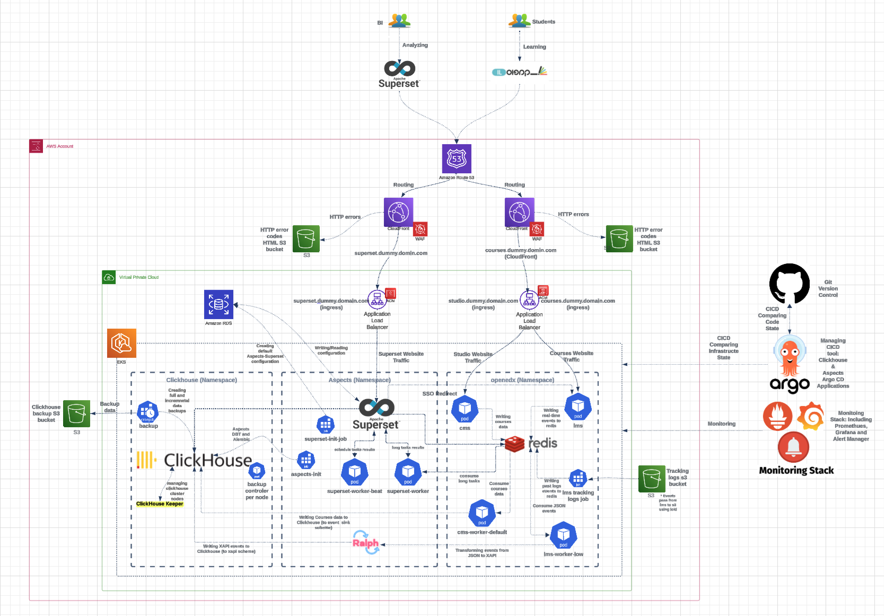
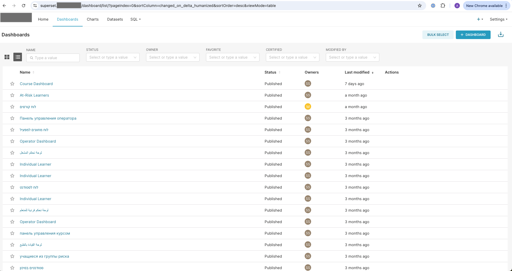
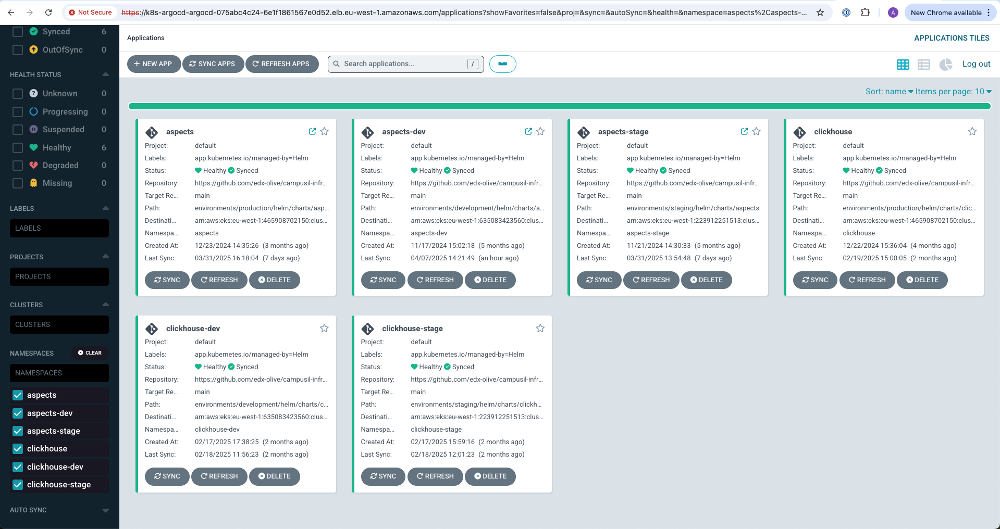
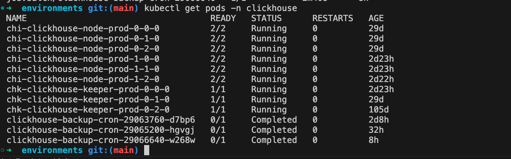
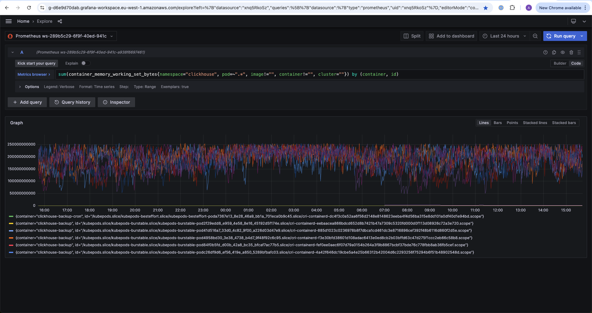
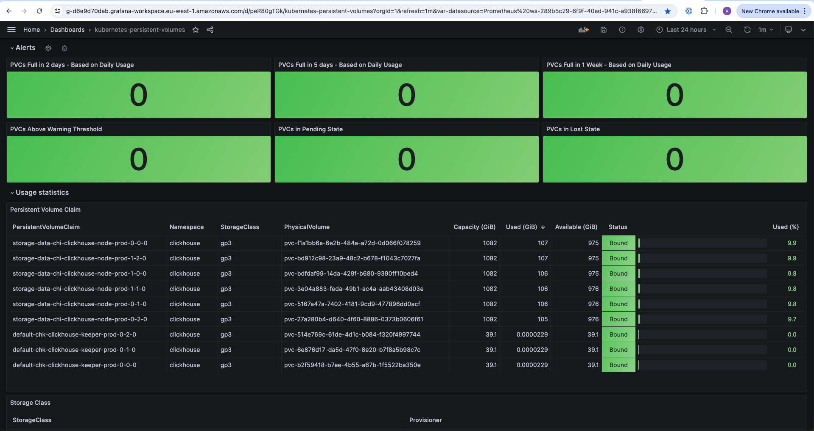

# OpenEdx Aspects – Customized Production System Implementation

This is an example of a project I developed for an OpenEdx customer. The project is an improved and customized implementation of the OpenEdx Aspects project.
While doing this project, I consulted with several OpenEdx developers to improve their implementation and align it with the customer’s needs. At the end of the project, I was invited to lecture about our implementation at the OpenEdx Global Conference in Paris.

In short, Aspects is a Business Intelligence (BI) solution for OpenEdx, leveraging Superset. Aspects captures every event happening in the EDX (OpenEdx websites) and stores it in ClickHouse. Using Superset, clients—such as teachers or universities—can analyze their data, including course information, organization data, student details, and more.

My implementation was based on the OpenEdx Aspects Tutor implementation versions 1.1.0 and 1.2.0, which were in the early stages of the project and did not meet the needs of the OpenEdx customer. [OpenEdx Tutor Aspects 1.2.0](https://github.com/openedx/tutor-contrib-aspects/tree/v1.2.0).

## Aspects Architecture:

## Superset Dashboard:
  
  

## Key Improvements
Here are some of the improved sections I developed to make the Tutor-based system fit the customer’s needs.

DevOps Compatibility – The Tutor package did not include any basic DevOps integration tools such as ArgoCD, Terraform, Helm charts, security configurations, backups, or high availability.

ClickHouse Cluster and DBT – I created and managed a ClickHouse cluster on an EKS (Elastic Kubernetes Service) cluster. Since the Tutor implementation did not support ClickHouse in cluster mode, I had to dive deep into the ClickHouse architecture, understand its objects, and make significant adjustments to Aspects. I also edited all the DBT files to make them compatible with the ClickHouse cluster.

High Traffic – While the Tutor system had been tested and optimized for traffic of around 10,000 events per day (according to the OpenEdx developers), we successfully tested and improved the system to handle 3 million events per day. This included improving several components such as Ralph (the router of events from Edx to ClickHouse), enabling ClickHouse cluster mode, and enhancing Edx components.

## Tools and Technologies Used:

- **Terraform**: Managed all the infrastructure.
- **Helm Chart**: Defined Kubernetes objects for Aspects and ClickHouse.
- **Argo CD**: Managed Helm charts using ArgoCD applications.  
  
- **High-Load System**: Built a system capable of handling around 1.5 million events per day, achieving near real-time processing.
- **Production Environment**: Worked with a live production environment.
- **Karpenter**: Managed scaling in the EKS cluster.
- **OpenEdx/MOOC**: Integrated the project with the MOOC platform (took events from the MOOC platform and created SSO integration with it).
- **ClickHouse Cluster**: Stored all events from the EDX courses and studio websites.

- **DBT**: Making all the creation of the Clickhouse Objects in few minutes using a simple K8S job. 
- **Python**: Developed scripts for editing and creating objects in ClickHouse, including scripts to restore past JSON events from S3 to ClickHouse.
- **Redis**: Managed task queues from Superset's worker and EDX LMS/CMS workers.
- **MySQL**: Handled Superset’s metadata.
- **AWS Services**: Utilized services like CloudFront, ALB Ingress, WAF, Secret Manager, Route 53, IAM, etc.
- **Monitoring**: Used Prometheus, Grafana, Loki, and Alert Manager for monitoring the application.  
    
  
- **Security**: Secured sensitive information, used WAF to block unauthorized access, and configured Superset user's permissions.
- **Backup Management**: Created backup solutions for the ClickHouse database (from K8s), MongoDB (for EDX data, from K8s), and MySQL (from K8s).
- **Version Control**: Used Git, GitHub, and Alembic (version control for ClickHouse objects).
- **Documentation**: Documented every part of the solution.
- **Atlassian Tools**: Used Jira and Confluence for project management and documentation.

## Additional Feature – AI Chat (Amazon Bedrock Integration).
After finishing the project, the customer requested an additional feature for the system: an AI chat to help Superset users create dashboards automatically, without any knowledge of MySQL. The AI chat is a React–Python-based website embedded in a Superset dashboard via an iframe. The backend of the website is powered by Amazon Bedrock.
While developing this feature, I deep-dived into the AI domain and learned about topics such as Automated RAG solutions, guardrails, and AI agent configuration.
